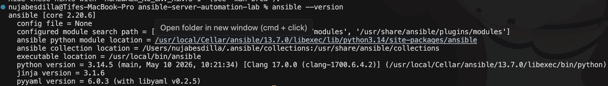
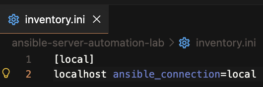
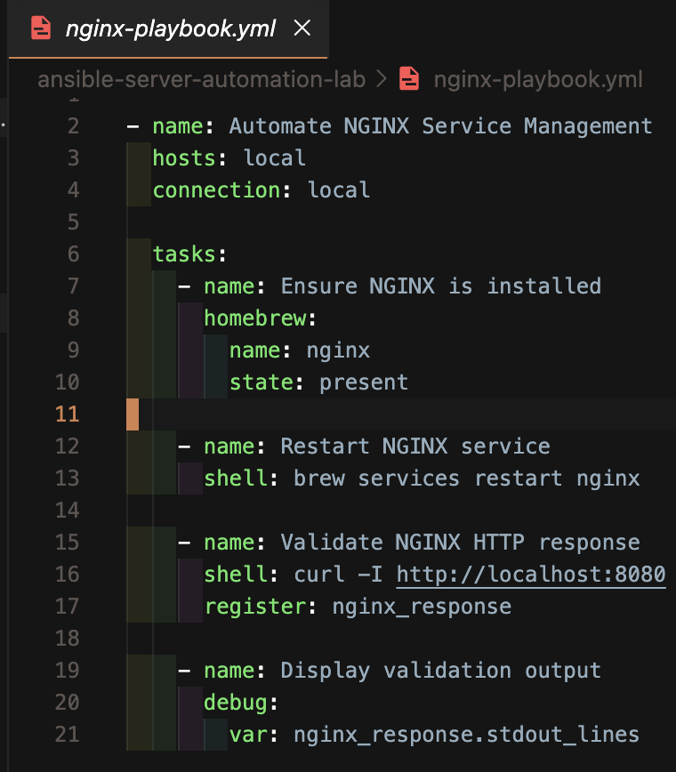
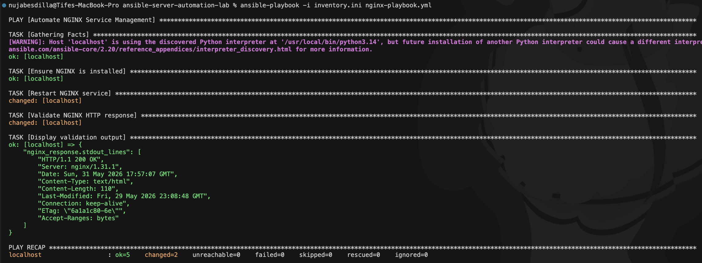
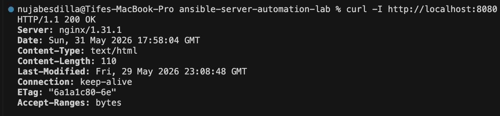
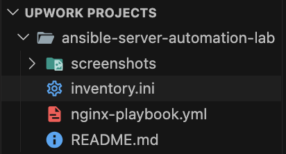

# Ansible Server Automation Lab

## Overview

Automated NGINX service management using Ansible. This project demonstrates configuration management, infrastructure automation, service validation, and YAML-based DevOps workflows.

## Architecture

```text
Ansible Control Node
        ↓
Inventory File
        ↓
Playbook Execution
        ↓
NGINX Service Validation
```

## Technologies

- Ansible
- NGINX
- YAML
- Bash
- macOS/Linux Terminal
- VS Code

## Implementation

- Created an Ansible inventory file
- Built an automation playbook
- Automated NGINX installation validation
- Restarted NGINX through Ansible
- Validated HTTP response with curl
- Documented execution results

## Commands Used

```bash
ansible --version
ansible-playbook -i inventory.ini nginx-playbook.yml
curl -I http://localhost:8080
```

## Screenshots

### Ansible Version


### Inventory Configuration


### Playbook Configuration


### Playbook Execution


### NGINX Validation


### Project Structure


## Key Outcomes

- Automated service management
- Practiced configuration management
- Validated infrastructure using Ansible
- Documented repeatable automation workflows